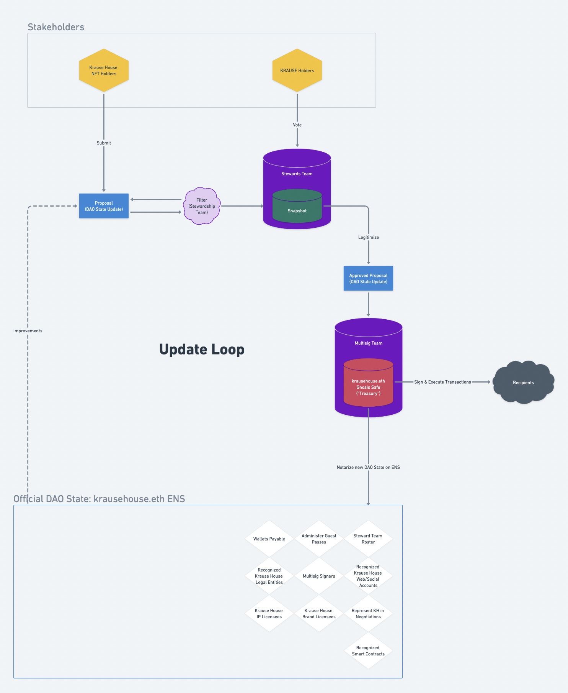

# Krause House Governance State

The official Krause House governance at any time can be found at this link. This is updated by the community via proposal on Snapshot.

### Table of Contents

- [Permissions Roster](./permissions.md): List of powers delegated by the DAO, and the respective delegates.
- [Norms](./norms.md): List of principles that guide the direction of the systems we build.
- [Proposals Process](./proposals-process.md)
- [Intentions](./intentions.md): List of intentions we agree to rally around.

#### Recognized Smart Contracts

- [$KRAUSE Token](https://etherscan.io/address/0x9f6f91078a5072a8b54695dafa2374ab3ccd603b)
- [Genesis Edition Tickets](https://etherscan.io/token/0xc4e0f3ec24972c75df7c716922096f4270b7bb4e)
- [NFT NYC Special Edition Tickets](https://etherscan.io/token/0x591E13ed6C78c0dc715336947db818ddB85a6ffE)

#### Recognized Legal Entities

- Krause House DAO (Panama) Foundation
- Krause House Capital (Lewwwk)

---

### Visual Representation

This is meant to help visualize the above state. If there is any conflict between this visual and the state above, the state above should be considered the source of truth.

